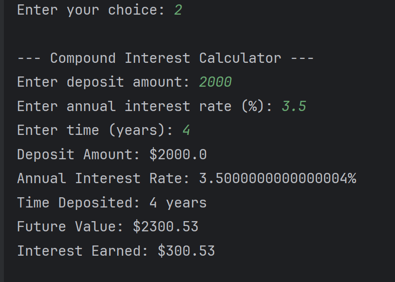

# 📊 Financial Calculator Application

This is a simple **Java console-based financial calculator** that provides three different calculators:

1. **Mortgage Calculator**
2. **Compound Interest Calculator**
3. **Annuity Calculator**  

It prompts users for input, performs the required calculations, and displays the results in a clean and user-friendly format.

---

- **Mortgage Calculator**:  
  Calculates monthly payments and total interest based on principal, interest rate, and loan duration.

- **Compound Interest Calculator**:  
  Computes future value and total profit based on deposit, annual interest rate, and duration.

- **Annuity Calculator**:  
  Calculates the present value needed to fund regular payouts given interest rate and time period.

- **Error Handling**:  
  Detects invalid inputs and displays appropriate error messages.  


### 🏠 Home Screen


---

### 🏦 Mortgage Calculator
**Inputs:** Principal, Interest Rate, Loan Duration  
**Output:** Monthly Payment + Total Interest


---

### 💰 Compound Interest Calculator
**Inputs:** Deposit, Interest Rate, Duration  
**Output:** Future Value + Profit



---

### 📈 Annuity Calculator
**Inputs:** Monthly Payout, Interest Rate, Duration  
**Output:** Required Present Value


---

### ⚠️ Error Handling Example
The program handles invalid inputs using simple if-else checks. For example, if the user enters a wrong menu option, the program will display an error message instead of crashing

 


## ✨ Interesting Code Snippet

```java
boolean running = true;

while (running) {
    System.out.println("Hello, welcome to Pluralsight Financial Calculator");
    System.out.println("Please enter which calculator you would like to use: ");
    System.out.println("1: Mortgage Calculator");
    System.out.println("2: Compound Interest Calculator");
    System.out.println("3: Annuity Calculator");
    System.out.println("0: Exit");

    int choice = scanner.nextInt();

    if (choice == 1) {
        mortgageCalculator(scanner);
    } else if (choice == 2) {
        compoundInterestCalculator(scanner);
    } else if (choice == 3) {
        annuityCalculator(scanner);
    } else if (choice == 0) {
        running = false;
        System.out.println("Goodbye!");
    } else {
        System.out.println("Invalid input, please try again.");
    }
}
```

The while (running) loop allows the program to keep running until the user explicitly exits.

This makes the app feel like a real interactive tool rather than a one-off script.

It also showcases control flow in Java with if-else logic, making the program more robust and user-friendly.