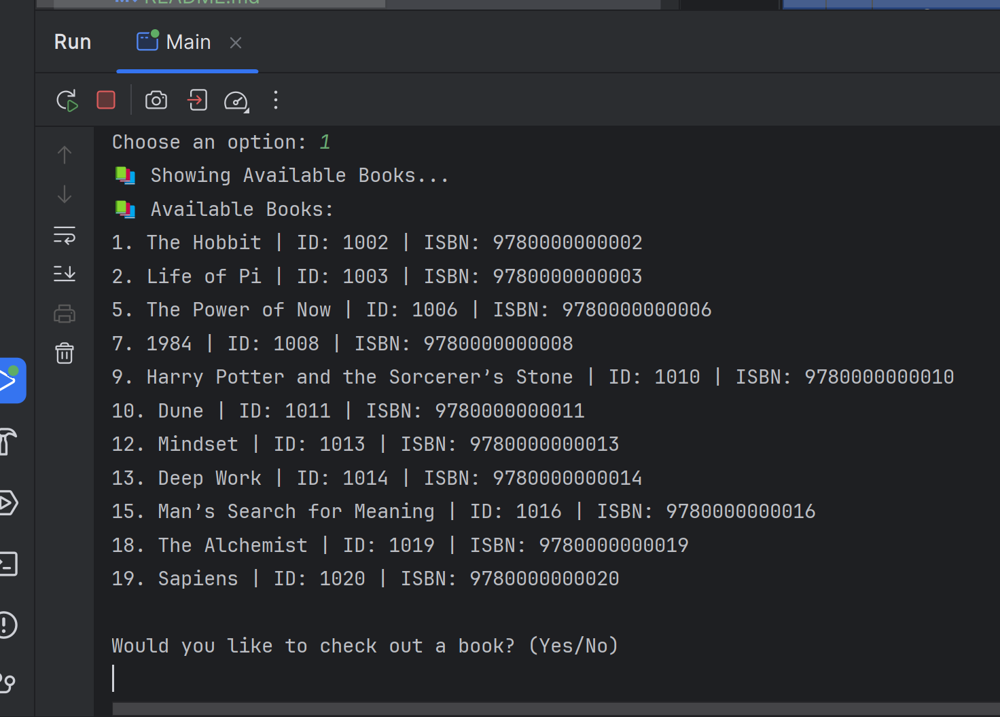
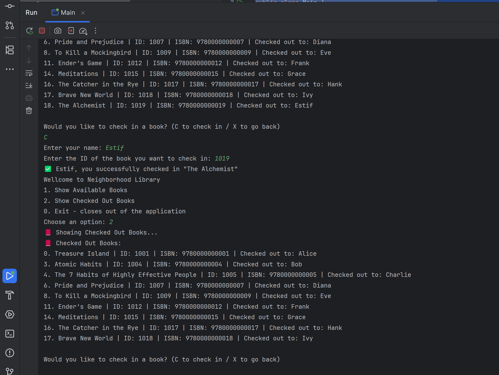
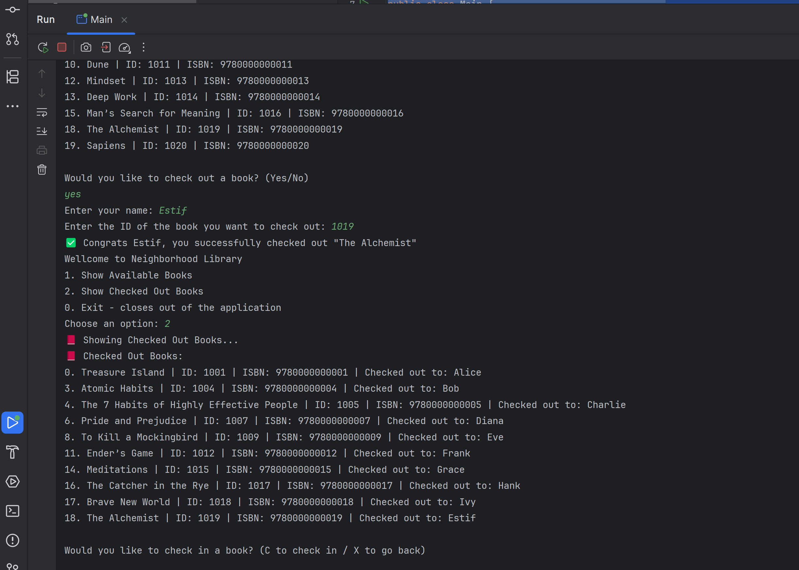
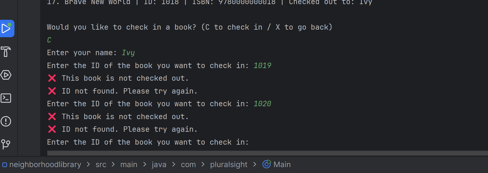

# 📚 Neighborhood Library Management System

## 📖 Project Description

The **Neighborhood Library Management System** is a console-based Java application that simulates a library's basic operations.

### Features

- **View Available Books** – Displays books that are currently available for checkout.
- **Check Out Books** – Borrow a book by entering its ID and your name.
- **Check In Books** – Return books you've borrowed by entering your ID and name.
- **Track Borrowers** – Each book keeps track of who has borrowed it.

---

## 🖼️ Screenshots

### Main Menu

### Available Books

### Checked Out Books

### Checking Out a Book

### Handling Invalid Input

---

