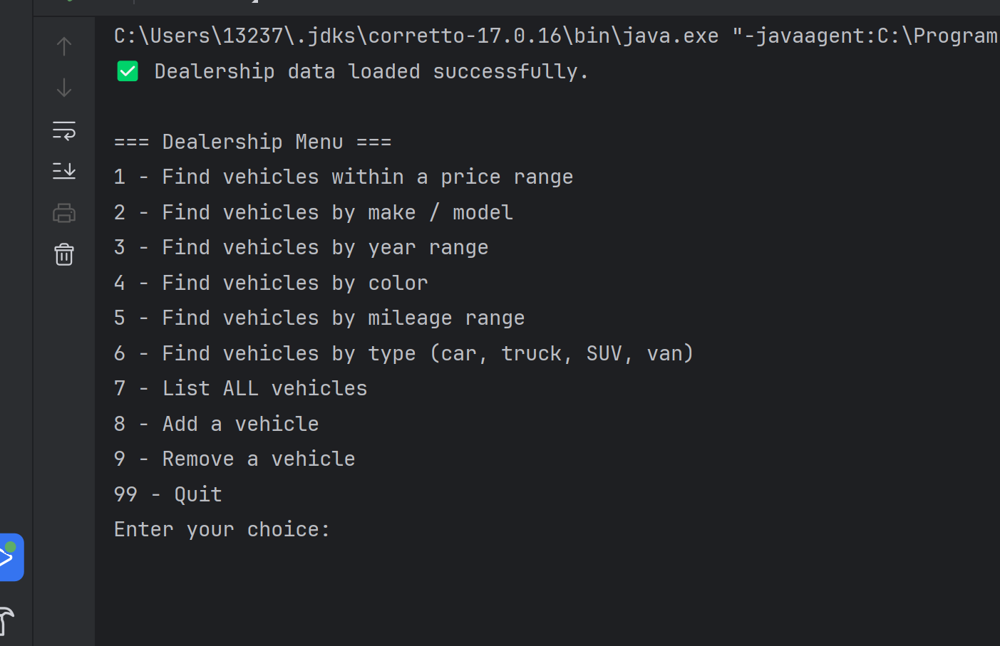

# 🚗 Car Dealership Management System

This is a Java console application that manages a car dealership’s inventory.  
You can view, search, add, and remove vehicles stored in a CSV file.

---

## 📘 Features

- View all vehicles in the dealership
- Search vehicles by:
    - Price range
    - Make and model
    - Year range
    - Color
    - Mileage range
    - Vehicle type
- Add or remove vehicles
- Automatically save and load data from `inventory.csv`

---

## 🧩 How It Works

- The program starts by loading data from `inventory.csv`.
- Users interact through a simple menu in the console.
- Vehicle information is stored and managed using classes and ArrayLists.
- Any changes are saved back to the file automatically.

---

## 🖼️ Screenshots

### 🏠 Home Screen


### 🚘 Vehicle Display Screen


---

## 💡 Interesting Code Snippet

```java
public ArrayList<Vehicle> getVehiclesByPrice(double min, double max){
    ArrayList<Vehicle> sortedVehicles = new ArrayList<>();
    for (Vehicle vehicle : this.inventory) {
        if (vehicle.getPrice() > min && vehicle.getPrice() < max) {
            sortedVehicles.add(vehicle);
        }
    }
    return sortedVehicles;
}
